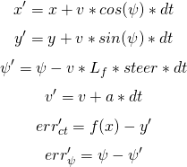

CarND-Controls-MPC
==================

Project 5 of Term 2 of the Udacity Self-Driving Car Engineer Nanodegree Program

---

About This Project
------------------

The assignment for this project was to control a simulated car around a simulated track using
Model Predictive Control. The path around the track is provided as a set of sparse waypoints by
the simulator. I chose 40 MPH as the objective speed to go around the track.

Preprocessing
-------------

I performed minimal preprocessing on the waypoints. I convert them to the vehicle-centric coordinate
frame, then perform a quadratic polynomial fit. The zero-order term of the polynomial fit is equal
to the cross-track error, and the arc-tangent of the first-order term of the polynomial fit is
equal to the heading error.

The Model
---------

The state vector fed into the MPC optimizer is then 0 for x, y, z, and heading (because the
optimization is performed in the vehicle frame), the current velocity, cross-track error, heading
error, and the current acceleration and steering angle, which are estimated from the current
throttle and steering commands. I estimated a scale factor to convert brake and gas commands to
acceleration, and I used the known steering limits (±25°) to convert steering commands to steering
angles.

The model itself (above) is a kinematic model of the car, based on the model described in the
lessons. `Ψ` is heading, `L_f` is the length parameter of the car, and `steer` is the steering
angle, which is used to calculate the steering command. `a` is the acceleration, which is used to
calculate the throttle/brake command. `err_ct` is the cross-track error, and `f(x)` is the y
position of the path, as calculated by with the polynomial fit. `err_Ψ` is the heading error.

In order to choose a good number of time steps `N` and time step length `dt` for prediction, I first
tuned the cost function so that the car could go around the track at 40 MPH with `N=10` and
`dt=0.10`. Then, I tried many different combinations of `N` and `dt`:

N  |  dt   | Result
----------------------------------------------------------------------------------
20 | 0.100 | Wildly unstable; leaves track on straightaway
15 | 0.100 | Quickly leaves the track
12 | 0.100 | Completes bridge, first turn, leaves track at second turn
11 | 0.100 | Completes almost full lap, leaves track near start
10 | 0.100 | Loops indefinitely without leaving the track
 9 | 0.100 | Loops indefinitely without leaving the track
 8 | 0.100 | Nearly leaves track into dirt at first turn
10 | 0.050 | Leaves track at first turn
15 | 0.050 | Loops indefinitely without leaving the track; worse than 10x0.10
20 | 0.050 | Loops indefinitely without leaving the track
25 | 0.050 | Unstable weaving; leaves track before bridge
20 | 0.025 | Very jerky; leaves track at second turn
25 | 0.025 | Very jerky, but completes track
30 | 0.025 | Very jerky; hops onto curb in second turn; leaves track later in lap

Based on these results, I chose to use `N=20` and `dt=0.050`. I found that with shorter `dt`, more
time steps were needed for good performance, but as `N` exceeded 20, the computation time for the
optimization got too long (approaching 100 ms), which causes jerky control and instability due to
the added delay.

Handling Latency
----------------

Model predictive control allows the controller to handle latency by simulating it in the control
model. My control model has a parameter to set the number of time steps of latency. For that
number of time steps, the control actuation is frozen at current value, which simulates the
actual behavior of the car. The actuation commands returned by the simulator are the first set that
occur after the simulated latency. Of course, the latency still makes the car less responsive,
but at least the model reflects this unresponsiveness and tries to optimize the car's path in
spite of it.

Building and Running
--------------------

### Dependencies

* cmake >= 3.5
* make >= 4.1
* gcc/g++ >= 5.4
* [uWebSockets](https://github.com/uWebSockets/uWebSockets) == 0.14
* [Ipopt](https://projects.coin-or.org/Ipopt) >= 3.12.1
* [CppAD](https://www.coin-or.org/CppAD/)
* Simulator. You can download these from the [releases tab](https://github.com/udacity/CarND-MPC-Project/releases).

### Basic Build Instructions

1. Clone this repository.
2. Make a build directory: `mkdir build && cd build`
3. Compile: `cmake .. && make`
4. Run it: `./mpc`.

